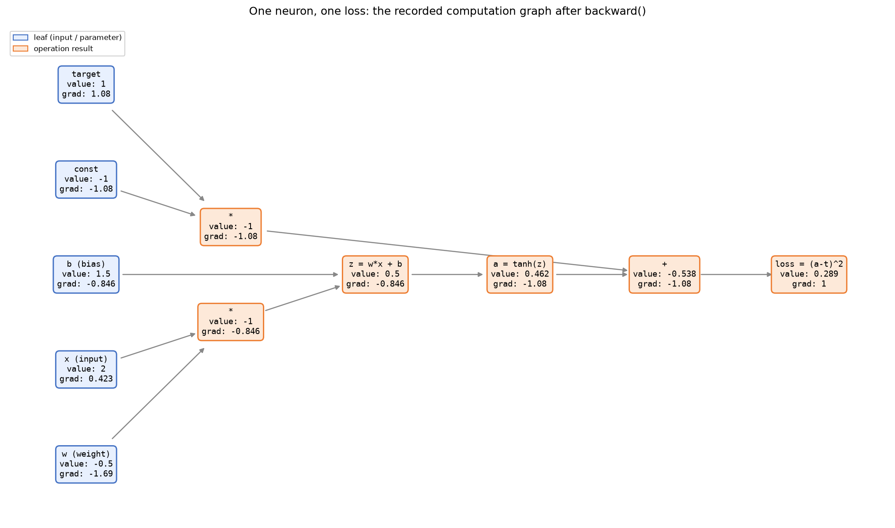
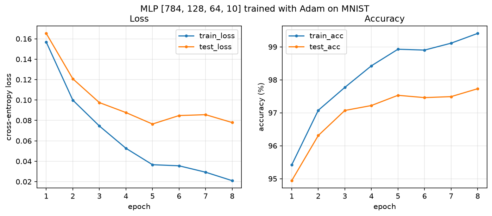
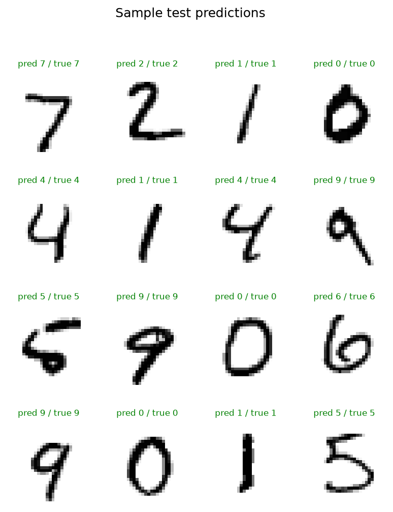
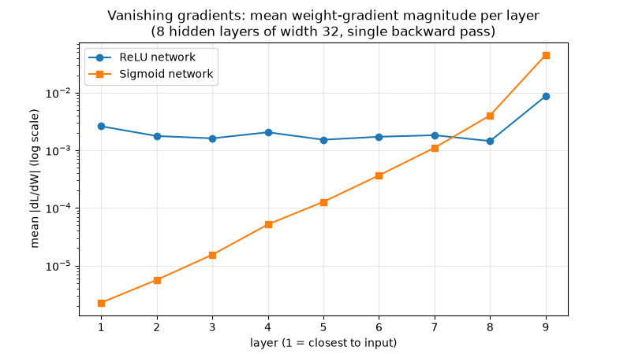

# tensorgrad

**A reverse-mode automatic differentiation engine and neural-network library,
built from scratch in Python - and trained to 97.7% accuracy on real
handwritten digits.**



*The engine's actual recorded computation graph for a single neuron: every box
shows the value computed on the forward pass and the gradient deposited by the
backward pass. This is backpropagation made visible.*

---

## The problem

Every modern deep-learning framework - PyTorch, TensorFlow, JAX - is built on
one idea: **reverse-mode automatic differentiation**, better known as
backpropagation. It is the algorithm that lets a network with millions of
parameters figure out, efficiently and exactly, how much each parameter
contributed to its error.

Frameworks hide this machinery so well that it is easy to use neural networks
daily without understanding how gradients actually happen. The goal of this
project was to remove the mystery: **implement the differentiation machinery
myself, from first principles, and prove it works by training a real network
on a real task.**

The rules I set:

- **No deep-learning frameworks.** No PyTorch, TensorFlow, JAX, or autograd -
  not even for checking results. Every derivative is derived by hand.
- **NumPy for arithmetic only.** NumPy makes array math fast, but it knows
  nothing about gradients. All differentiation logic is mine.
- **It must work on a real task.** Toy examples hide bugs. The end goal is
  classifying handwritten digits (MNIST, 70,000 images), the classic benchmark.
- **Every gradient must be verified.** Each operation's hand-derived
  derivative is checked numerically against finite differences.

## How it works (the short version)

### 1. Record the computation

The core object is a `Tensor` ([tensorgrad/engine.py](tensorgrad/engine.py)).
It wraps a NumPy array and behaves like one - you can add, multiply,
matrix-multiply, and apply functions like `tanh`. But every operation also
quietly records *how it was computed*: the output tensor remembers its input
tensors and a small function describing how a gradient at the output maps to
gradients at the inputs.

As your code runs, these records link together into a **computation graph** -
a network of every value that influenced the final result (rendered in the
figure above).

### 2. Walk it backwards

Calling `.backward()` on the final value (the *loss*) applies the **chain
rule** from calculus mechanically along that graph, from the loss back to
every input. Each node's recorded function passes the gradient one step
further upstream. One forward pass plus one backward pass yields the exact
derivative of the loss with respect to *every* parameter simultaneously - for
a cost comparable to just running the network twice. That efficiency is why
training deep networks is possible at all.

Two details make this correct in practice, and both are easy to get wrong:

- **Gradients accumulate.** If a value is used in two places, its gradient is
  the *sum* of both contributions (`x*x` must give `2x`, not `x`).
- **Broadcasting must be undone.** When NumPy stretches a small array (like a
  bias vector) across a large one (a whole batch), the gradient has to be
  summed back down to the original shape
  ([`_unbroadcast`](tensorgrad/engine.py)).

### 3. Verify every derivative

How do you know a hand-written gradient is right? You compare it against a
slow but nearly exact alternative: nudge each input up and down by a tiny
ε and measure how the output changes - the *finite-difference* estimate:

$$\frac{\partial f}{\partial x_i} \approx \frac{f(x + \varepsilon e_i) - f(x - \varepsilon e_i)}{2\varepsilon}$$

[tensorgrad/gradcheck.py](tensorgrad/gradcheck.py) implements this, and
[tests/test_gradcheck.py](tests/test_gradcheck.py) applies it to **every
operation in the engine** - including a deep composite expression exercising
many ops at once. All analytical gradients agree with the numerical estimates
to a relative error below 10⁻⁵. This is the same verification technique used
when developing real frameworks.

### 4. Build a neural network on top

With gradients handled automatically, a neural-network library becomes
remarkably small:

- [tensorgrad/nn.py](tensorgrad/nn.py) - `Linear` layers (He initialisation),
  ReLU/Tanh/Sigmoid activations, and an `MLP` builder, in the style of
  PyTorch's `nn.Module`.
- [tensorgrad/functional.py](tensorgrad/functional.py) - softmax and
  cross-entropy loss, implemented with the log-sum-exp trick so large scores
  don't overflow floating point.
- [tensorgrad/optim.py](tensorgrad/optim.py) - three optimisers: plain
  gradient descent (SGD), SGD with momentum, and Adam.

None of these files contain any derivative code. They only describe *forward*
computations; the engine differentiates them.

## Results

### 97.73% test accuracy on MNIST

A 3-layer MLP (784 → 128 → 64 → 10, ~109k parameters) trained with Adam for
8 epochs on the full 60,000-image training set, evaluated on the untouched
10,000-image test set. Total training time: about 30 seconds on a laptop CPU.



Sample predictions on unseen test digits:



### Watching gradients vanish

Because the engine exposes every gradient, classic deep-learning phenomena
become directly observable. This experiment sends one backward pass through
two 8-hidden-layer networks that differ only in activation function. With
sigmoid activations, each layer multiplies the gradient by at most 0.25 - by
layer 1 the gradient is **four orders of magnitude smaller**, meaning early
layers barely learn. ReLU keeps gradients stable - this is precisely why
modern networks use it:



## How to run it

Requires Python 3.10+.

```bash
git clone <this-repo>
cd tensorgrad
python -m venv .venv
# Windows:            .venv\Scripts\activate
# macOS / Linux:      source .venv/bin/activate
pip install -r requirements.txt
```

Run the test suite (42 tests, including all gradient checks):

```bash
pytest -q
```

Reproduce the results:

```bash
python experiments/train_mnist.py             # MNIST download is automatic (~11 MB)
python experiments/computation_graph_demo.py  # the graph figure above
python experiments/gradient_flow_demo.py      # the vanishing-gradient figure
```

Or use it as a library:

```python
import numpy as np
from tensorgrad import Tensor
from tensorgrad import nn
from tensorgrad.functional import cross_entropy
from tensorgrad.optim import Adam

net = nn.MLP([784, 128, 64, 10], activation="relu")
opt = Adam(net.parameters(), lr=1e-3)

logits = net(Tensor(x_batch))            # forward pass
loss = cross_entropy(logits, y_batch)    # scalar loss
opt.zero_grad()
loss.backward()                          # gradients for all 109k parameters
opt.step()                               # one Adam update
```

## Project structure

```
tensorgrad/
  engine.py      # the autodiff core: Tensor, computation graph, backward()
  gradcheck.py   # finite-difference gradient verification
  nn.py          # Module, Linear, activations, Sequential, MLP
  functional.py  # stable softmax, cross-entropy, accuracy
  optim.py       # SGD, SGD+momentum, Adam
  data.py        # MNIST loader (auto-download), synthetic spirals, minibatches
  viz.py         # training curves, gradient-flow plots, prediction grids
  graph.py       # computation-graph renderer
experiments/     # the three runnable experiments
tests/           # 42 tests: behaviour + numerical gradient checks
figures/         # generated results used in this README
```

## Design decisions

- **Tensor-based, not scalar-based.** Educational autodiff engines often
  track one number at a time, which is elegant but hopelessly slow for images.
  Operating on whole arrays keeps the engine just as transparent while making
  real training runs take seconds, not days.
- **Losses are compositions, not special cases.** Cross-entropy is written
  purely out of engine operations (`exp`, `log`, `sum`, ...), so its gradient
  comes from the same machinery as everything else - and is verified by the
  same gradient checker. No hand-fused loss gradients.
- **Verification as a feature.** The gradient checker is part of the library,
  not just the tests. Correctness evidence was a first-class goal.

## What I'd do next

- **Softmax-with-cross-entropy fusion** - measure the speed/stability gain of
  the fused gradient every framework ships, and verify it against the
  compositional version already in the engine.
- **Convolutional layers** - implement `conv2d` and its (significantly
  trickier) backward pass; MNIST accuracy should push past 99%.
- **Regularisation** - dropout and L2 weight decay, then study their effect on
  the train/test gap visible in the training curves.
- **Second-order insight** - use the engine to visualise loss-surface
  curvature along training trajectories.

## License

MIT - see [LICENSE](LICENSE).

---

## Portfolio summary

> **tensorgrad - backpropagation from first principles.** I built the core
> algorithm behind all modern deep learning - reverse-mode automatic
> differentiation - from scratch in Python, using NumPy only for raw array
> arithmetic. On top of it I wrote a small neural-network library (layers,
> stable losses, and the SGD, momentum, and Adam optimisers) and trained a
> ~109,000-parameter network to **97.7% accuracy** on MNIST handwritten
> digits in 30 seconds on a CPU. Every hand-derived gradient is verified
> against numerical finite differences in a 42-test suite, and the engine can
> render its own computation graph - making the chain rule, and classic
> effects like vanishing gradients, directly visible.

**Suggested portfolio thumbnail:** `figures/computation_graph.png` - it is
unique to this project and instantly communicates "I built the graph engine
itself." Use `figures/mnist_training_curves.png` as a secondary image where a
results-oriented visual fits better.
